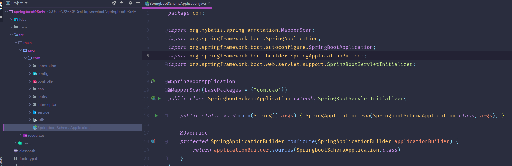
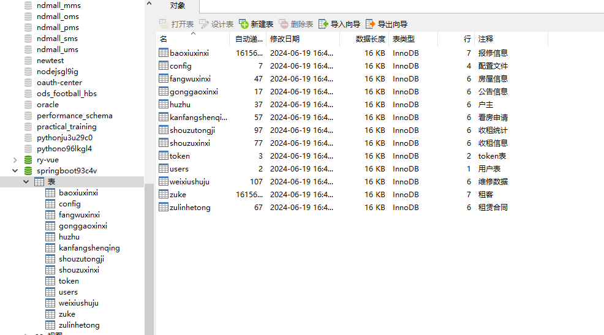
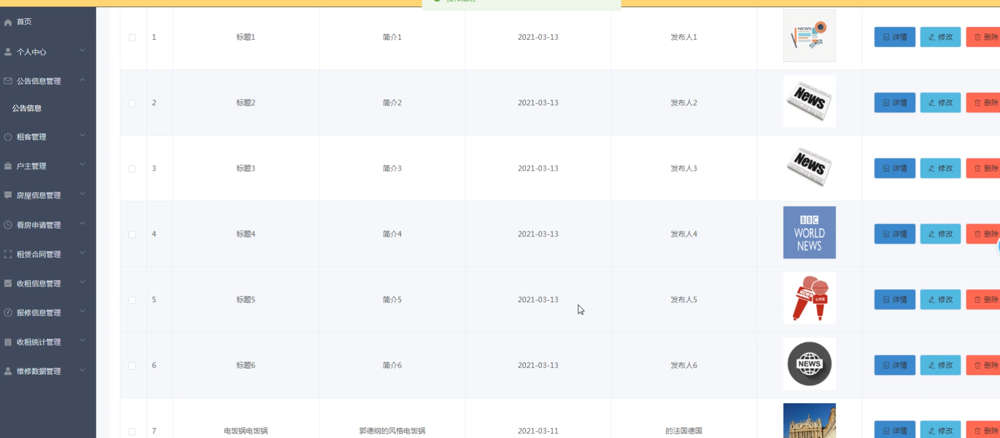
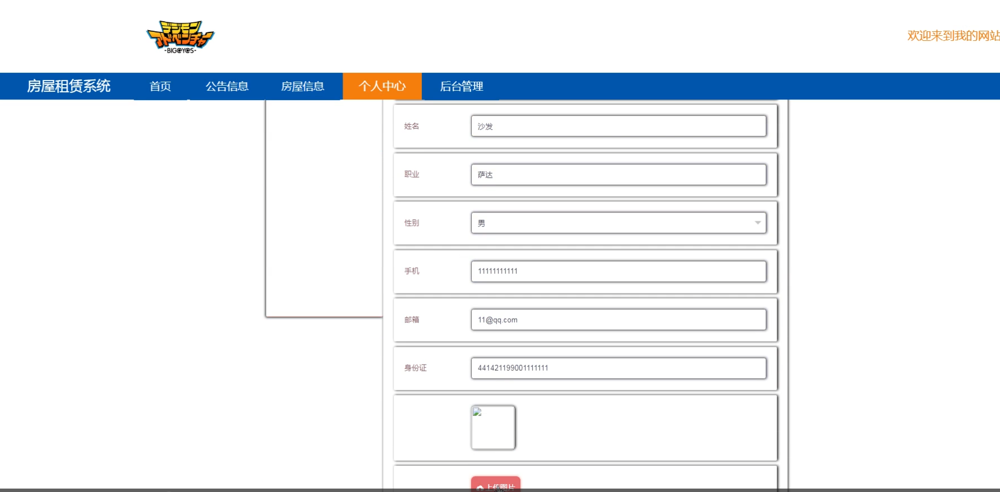
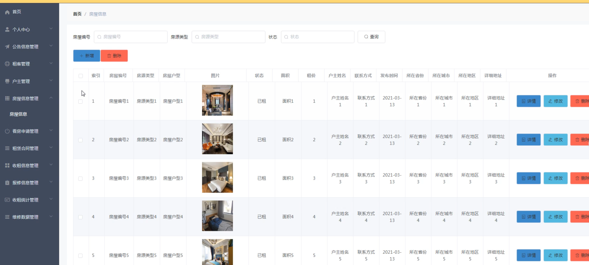
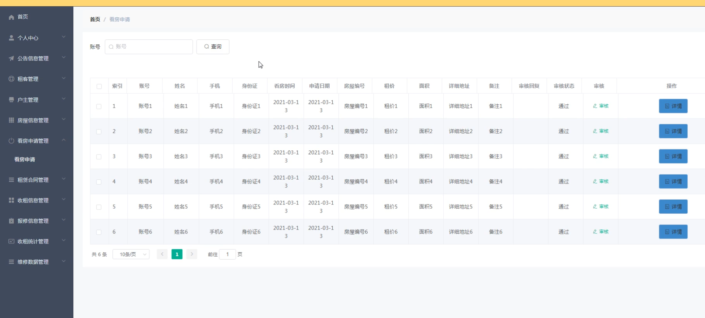
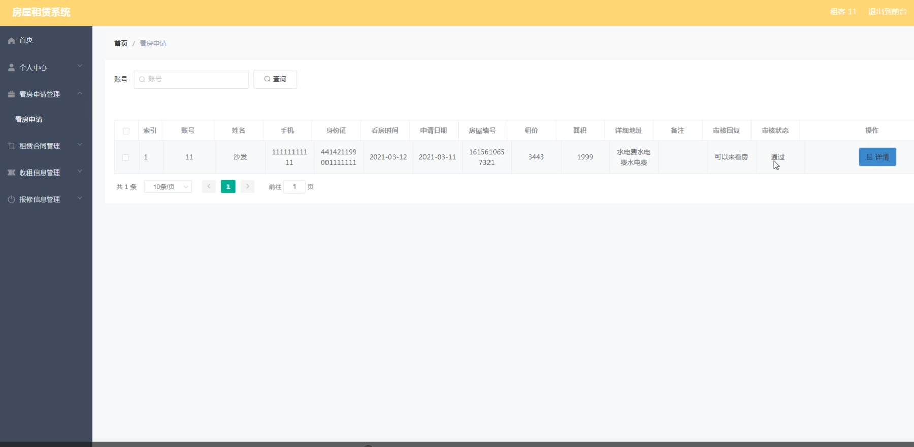
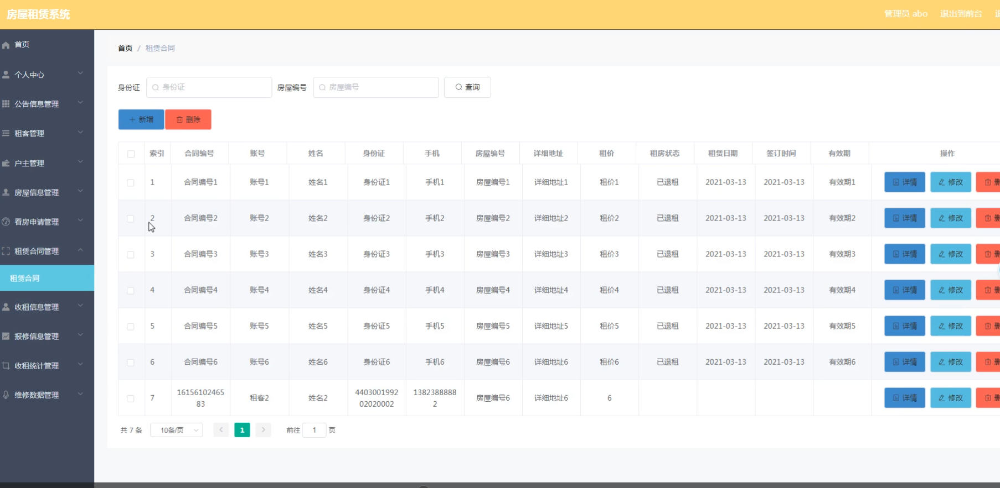
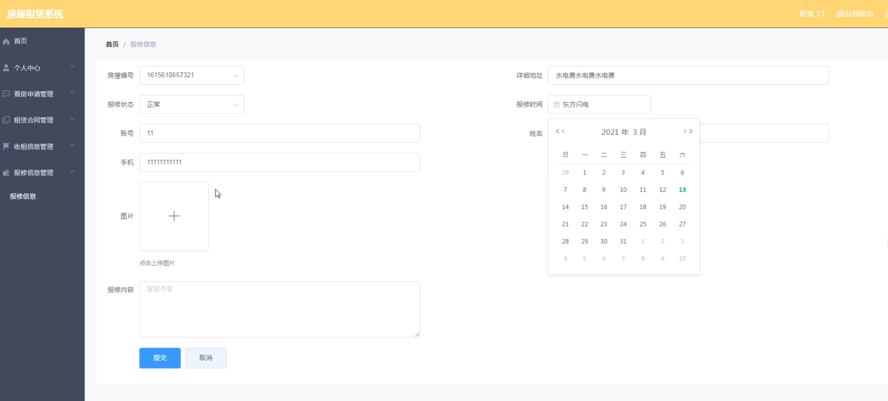

# 基于springboot的房屋租赁系统

#### 介绍

基于SpringBoot的房屋租赁系统提升了房屋租赁的管理效率和租客体验。系统的设计涵盖了房屋租赁过程中的各个环节，从房源发布、租赁合同管理、租金收取到报修处理，提供了一套完整的解决方案。该系统分为管理员角色和租客角色，提供了丰富的功能模块以满足不同用户的需求。管理员可以高效地管理房屋和租客信息，确保业务流程的顺畅；租客则可以方便地找到理想房源，进行在线租赁和报修，提高居住体验。

#### 技术栈介绍

后端技术栈：Springboot+Mysql+Maven

前端技术栈：Vue+Html+Css+Javascript+ElementUI

开发工具：Idea+Vscode+Navicate

#### 系统功能介绍

管理员角色功能模块

个人中心：管理员可以查看和编辑个人信息，包括修改密码和更新联系方式，确保个人信息的准确性和安全性。

公告信息管理：管理员可以发布和管理系统公告，确保所有用户及时获取重要通知和信息。

租客管理：管理租客信息，包括新增、修改和删除租客资料，方便租客信息的维护和查询。

户主管理：管理房屋所有者信息，确保房东和房屋信息的准确性和完整性。

房屋信息管理：管理房屋的详细信息，包括新增、修改和删除房源，确保房源信息的及时更新和准确。

看房申请管理：处理租客提交的看房申请，安排看房时间和管理看房记录，确保看房过程的有序进行。

租赁合同管理：管理租赁合同的签订、修改和存档，确保合同管理的规范化和标准化。

收租信息管理：记录和管理租金收取信息，确保租金收取的准确性和及时性，提供财务数据支持。

报修信息管理：处理租客提交的报修请求，安排维修任务并跟踪维修进度，确保报修问题的及时解决。

收租统计管理：统计和分析租金收取数据，为财务决策提供支持，帮助管理员进行收入管理。

维修数据管理：管理和分析维修数据，确保维修工作及时有效，提高维修管理的效率。

租客角色功能模块

公告信息：查看系统公告，获取重要通知和信息，确保及时了解最新动态。

房屋信息：浏览和查看房屋详细信息，选择合适的房源，提供便捷的找房体验。

个人中心：查看和编辑个人信息，包括修改密码和更新联系方式，确保个人信息的准确性和安全性。

后台管理

看房申请管理：提交看房申请，查看看房记录，安排看房时间，方便看房操作。

租赁合同管理：查看租赁合同的详细信息，管理个人租赁合同，确保合同管理的规范性。

收租信息管理：查看租金收取记录，了解租金支付情况，方便租金管理。

报修信息管理：提交报修请求，查看报修处理进度和历史记录，确保居住问题得到及时解决。

#### 系统作用

对管理员的作用

高效管理：系统提供了完善的管理工具，帮助管理员高效地管理公司组织结构和员工信息，确保管理工作的高效性和准确性。

信息传达：通过公告信息管理模块，管理员可以快速传达公司重要通知和信息，确保信息的及时传递和沟通。

数据分析：通过收租统计和维修数据管理模块，管理员可以进行数据分析，为租赁管理和决策提供数据支持。

对租客的作用

便捷租房：租客可以通过系统方便地浏览房源信息，提交看房申请，提高找房效率。

信息获取：租客可以通过系统及时获取公告信息和租金收取记录，确保信息的透明和沟通的顺畅。

报修管理：租客可以方便地提交报修请求，跟踪报修进度，确保居住问题得到及时解决。

#### 系统功能截图

代码结构

数据库表

登录

公告信息管理

租客管理

租客端个人中心

房屋信息管理

看房申请管理

租客后台管理

租赁合同管理

报修信息管理

#### 总结

基于SpringBoot的房屋租赁系统通过角色分工和功能模块的设计，实现了房屋租赁管理的高效化。管理员可以通过系统全面管理租客、房东和房屋信息，租客则可以便捷地进行找房、租房和报修操作。该系统不仅提升了房屋租赁管理的效率和准确性，也为租客提供了便捷的租房体验，确保信息的透明和沟通的顺畅。

#### 使用说明

创建数据库，执行数据库脚本 修改jdbc数据库连接参数 下载安装maven依赖jar 启动idea中的springboot项目

后台地址：http://localhost:8080/springboot93c4v/admin/dist/index.html

管理员  abo 密码 abo

前台地址：http://localhost:8080/springboot93c4v/front/index.html

